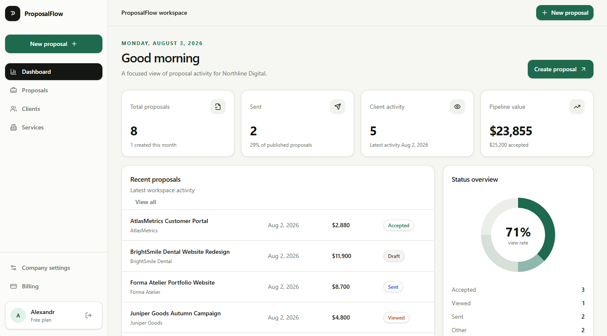

# ProposalFlow

**Commercial proposal web application built with Next.js, React and TypeScript.**

ProposalFlow is a responsive SaaS-style application for creating,
sharing and tracking professional commercial proposals.

[Live Demo](https://proposalflow-six.vercel.app)

## Frontend Highlights

The project includes:

- responsive SaaS dashboard interfaces
- reusable React UI components
- authenticated application layouts
- client and service management interfaces
- proposal creation and editing flows
- dynamic pricing and discount UI
- proposal status filtering
- public client-facing proposal pages
- form validation and application states
- responsive desktop and mobile layouts
- data-driven dashboard metrics
- client/server interaction with Next.js

**Frontend stack:** Next.js · React · TypeScript · Tailwind CSS

**Additional project experience:** Supabase · PostgreSQL · Auth ·
Row Level Security · Storage · Server Actions



## Live Demo

https://proposalflow-six.vercel.app

## Product Overview

ProposalFlow replaces disconnected documents, spreadsheets and email threads with one structured proposal workflow:

1. Add a client.
2. Create reusable services.
3. Create a proposal draft.
4. Add services, quantities, prices and discounts.
5. Send the proposal.
6. Share a public link with the client.
7. Track when the proposal is viewed.
8. Receive an accepted or rejected response.
9. Review the client’s name, email and comment.
10. Monitor proposal activity from the dashboard.

## Core Features

### Authentication

* Account registration
* Email confirmation
* Secure login
* Password recovery
* Protected application routes
* Supabase SSR session handling

### Company Workspace

* Company profile
* Contact information
* Default currency
* Brand accent color
* Company logo upload

### Client Management

* Create clients
* Edit client details
* Delete clients
* Store company and contact information
* Assign clients to proposals

### Service Catalog

* Create reusable services
* Configure prices and billing units
* Organize services by category
* Edit and delete services
* Add catalog services to proposals

### Proposal Management

* Create proposal drafts
* Assign clients
* Configure validity dates
* Add proposal items
* Change quantities and unit prices
* Apply percentage or fixed discounts
* Automatic subtotal and total calculation
* Draft, sent, viewed, accepted, rejected and expired statuses
* Filter proposals by status

### Public Proposal Experience

* Secure public proposal token
* Client-facing proposal page
* Owner preview mode
* Automatic sent-to-viewed transition
* Accept or decline proposal
* Optional client comment
* Final responses protected against duplicate submission
* Public routes available without authentication

### Dashboard

* Total proposal count
* Published and viewed activity
* Active pipeline value
* Accepted proposal value
* Status distribution
* Recent proposal activity
* Direct links to proposal editors

## Technology Stack

### Frontend

* Next.js 16 App Router
* React
* TypeScript
* Tailwind CSS
* Lucide React
* shadcn-compatible UI components

### Backend and Data

* Next.js Server Actions
* Supabase Auth
* Supabase PostgreSQL
* Supabase Storage
* PostgreSQL functions and triggers
* Row Level Security policies

### Validation and Tooling

* Zod
* ESLint
* TypeScript
* Supabase CLI
* npm

### Deployment

* Vercel
* Supabase Cloud
* GitHub

## Application Routes

### Public

* `/`
* `/pricing`
* `/login`
* `/register`
* `/forgot-password`
* `/reset-password`
* `/auth/confirm`
* `/p/[publicToken]`

### Authenticated Workspace

* `/dashboard`
* `/clients`
* `/clients/new`
* `/clients/[clientId]/edit`
* `/services`
* `/services/new`
* `/services/[serviceId]/edit`
* `/proposals`
* `/proposals/new`
* `/proposals/[proposalId]/edit`
* `/settings/company`
* `/settings/billing`

## Database Architecture

The Supabase schema includes:

* `profiles`
* `companies`
* `clients`
* `services`
* `proposals`
* `proposal_sections`
* `proposal_items`
* `proposal_views`
* `proposal_responses`
* `subscriptions`

Database migrations implement:

* Identity and company foundations
* Company asset storage
* Core ProposalFlow schema
* Proposal pricing calculations
* Public proposal access
* Public view status handling
* Public client responses

Proposal totals are calculated at the database level using PostgreSQL functions and triggers.

Public proposal reads and responses are handled through restricted `security definer` database functions rather than exposing unrestricted anonymous table updates.

## Security

* Protected workspace routes
* Supabase SSR authentication
* Row Level Security
* Owner-scoped client, service and proposal queries
* Public token-based proposal access
* Safe redirect path validation
* Server-side form validation
* Database-level response validation
* One final response per proposal
* Environment files excluded from Git
* No Supabase secret or service-role key in the repository

## Local Development

### Requirements

* Node.js 22 or newer
* npm
* Supabase project
* Supabase CLI for migration management

### Installation

```bash
git clone git@github.com:SuhihAlex/ProposalFlow.git
cd ProposalFlow
npm install
```

Create `.env.local`:

```env
NEXT_PUBLIC_SUPABASE_URL=https://your-project-ref.supabase.co
NEXT_PUBLIC_SUPABASE_PUBLISHABLE_KEY=your_publishable_key
```

Start the development server:

```bash
npm run dev
```

Open:

```text
http://localhost:3000
```

## Database Migrations

Link the local project to Supabase and apply migrations:

```bash
npx supabase link
npx supabase db push
```

Migration files are stored in:

```text
supabase/migrations
```

Optional demo data is stored in:

```text
supabase/seed.sql
```

Do not apply demo seed data to a real customer production workspace.

## Validation

Run all project checks:

```bash
npm run lint
npm run typecheck
npm run build
```

## Environment Variables

| Variable                               | Purpose                     |
| -------------------------------------- | --------------------------- |
| `NEXT_PUBLIC_SUPABASE_URL`             | Supabase project URL        |
| `NEXT_PUBLIC_SUPABASE_PUBLISHABLE_KEY` | Public Supabase browser key |

Never commit `.env.local`, Supabase secret keys or service-role keys.

## Production

Production deployment:

https://proposalflow-six.vercel.app

The production application uses:

* Vercel for the Next.js application
* Supabase for authentication, PostgreSQL and storage
* GitHub for source control and deployment integration

## Current MVP Scope

Implemented:

* Authentication
* Company workspace
* Client CRUD
* Service CRUD
* Proposal creation and pricing
* Public proposal sharing
* View-state tracking
* Client accept and decline workflow
* Client response details
* Real dashboard
* Production deployment

Possible post-MVP additions:

* Proposal content section editor
* PDF export
* Transactional email sending
* Custom domains
* Team workspaces
* Subscription billing
* Automated proposal reminders
* Analytics history

## Project Status

**MVP released and available in production.**

Developed as a full-stack SaaS portfolio project by KINETIC Studio.
